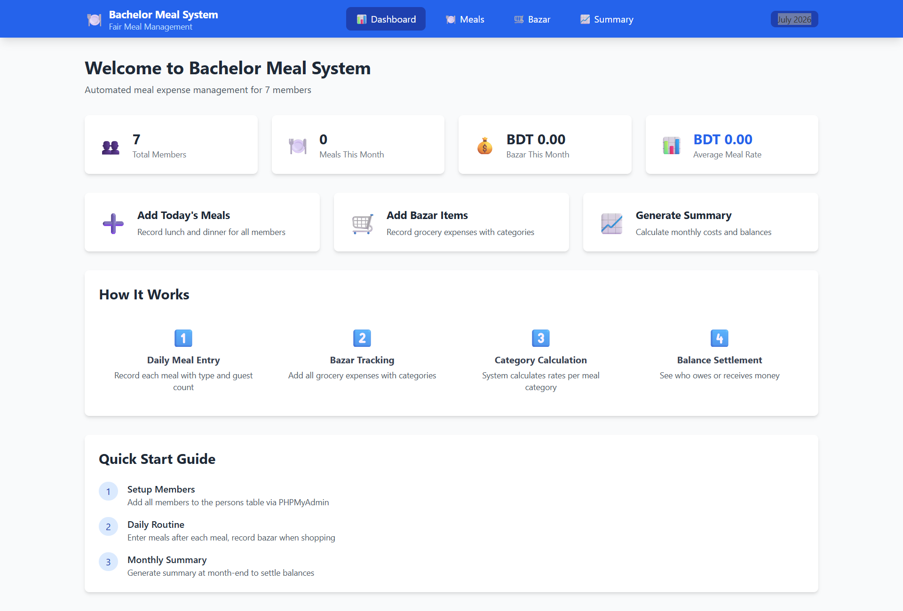
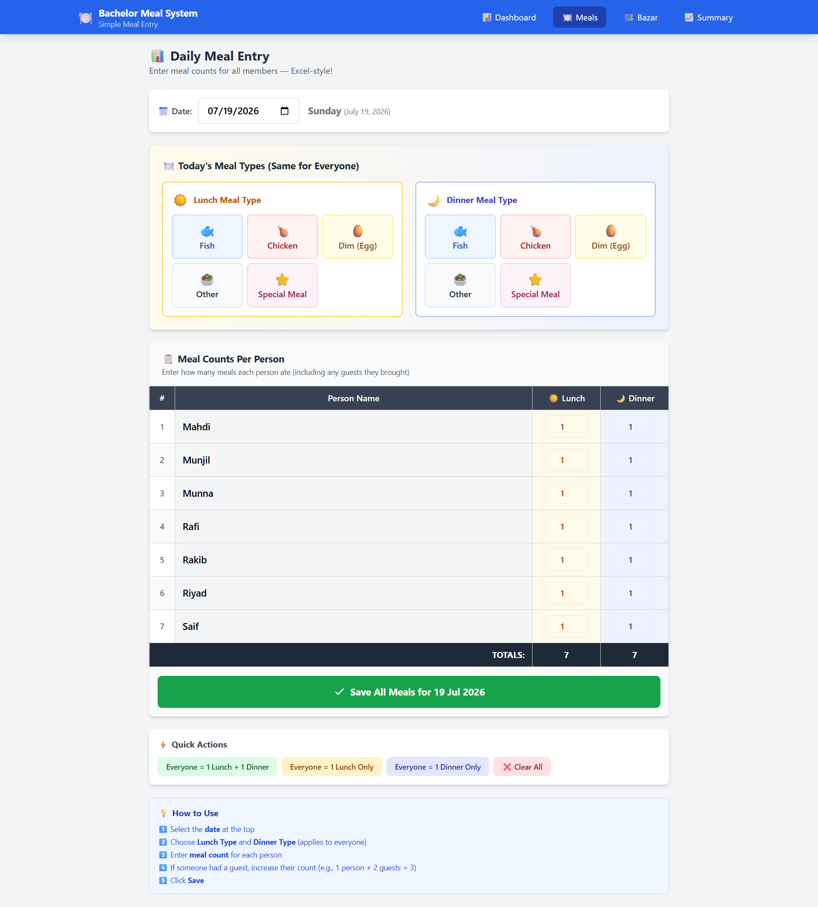
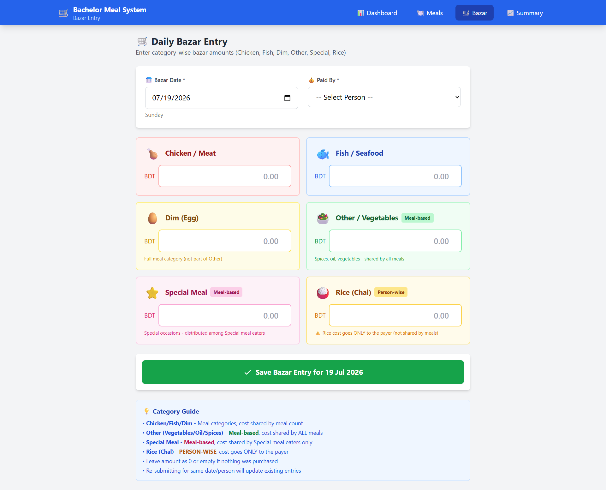
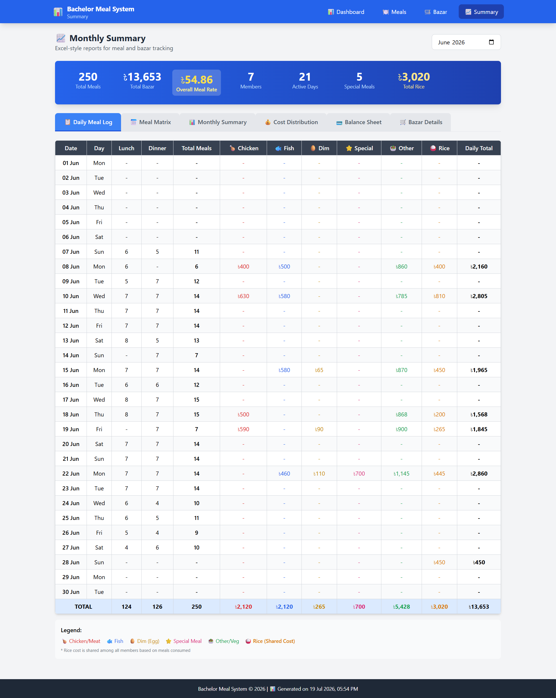

# 🍽️ Bachelor Meal System

> A simple, transparent, and automated meal management system for bachelor flats.

---

## 📋 Table of Contents

- [What is Bachelor Meal System?](#-what-is-bachelor-meal-system)
- [Why We Built This Project](#-why-we-built-this-project)
- [Key Features](#-key-features)
- [How the System Works](#-how-the-system-works)
- [Tech Stack](#️-tech-stack)
- [Screenshots](#-screenshots)
- [Installation & Setup](#-installation--setup)
- [Configuration](#️-configuration)
- [Usage Guide](#-usage-guide)
- [Project Structure](#-project-structure)
- [Future Improvements](#-future-improvements)
- [Contributing](#-contributing)
- [License](#-license)
- [Acknowledgments](#-acknowledgments)

---

## 📋 What is Bachelor Meal System?

**Bachelor Meal System** is a web-based application designed to manage daily meals, bazar expenses, and monthly cost calculations for shared living spaces like bachelor flats or hostels.

### The Problem We Solve

Living in a bachelor flat with multiple roommates? Then you know the struggle:

- 🤯 **Confusing meal calculations** — Who ate how many meals this month?
- 💸 **Bazar cost tracking nightmare** — Who paid for groceries? How much?
- 📊 **Monthly balance chaos** — Who owes money? Who should get money back?
- ✍️ **Manual register errors** — Handwritten registers get messy, pages get lost

**Bachelor Meal System** solves all these problems with a clean, automated, and fair system that:

✅ Tracks every meal automatically  
✅ Records all bazar expenses by category  
✅ Calculates fair meal rates based on actual costs  
✅ Shows exactly who owes what at month-end  
✅ Works on any device with a browser

---

## 🎯 Why We Built This Project

In Bangladesh and many South Asian countries, bachelor flats are common. A group of friends or colleagues share a flat and cook together. Every day, someone goes to the bazar (market), someone cooks, and everyone eats.

But at the end of the month, **calculating who owes what** becomes a headache:

| Manual Approach Problems     | Our Solution                |
|------------------------------|-----------------------------|
| Forgetting to note meals     | One-click meal entry        |
| Lost bazar receipts          | Digital expense tracking    |
| Unfair cost distribution     | Automatic rate calculation  |
| Arguments over money         | Transparent balance sheet   |
| Time wasted on calculations  | Instant monthly summary     |

**This system makes flat life peaceful!** 🏠✨

---

## ⭐ Key Features

### 🍛 Meal Management
- Add daily meals (Lunch & Dinner)
- Track meal types (Chicken, Fish, Egg, Vegetables, Special)
- Support for guest meals
- View meal history in calendar format

### 👥 Member Management
- Add/remove flat members
- Track individual meal counts
- Person-wise contribution tracking

### 🛒 Bazar Cost Tracking
- Record daily bazar expenses
- Categorize by type (Chicken, Fish, Rice, etc.)
- Track who paid for each purchase
- Item-wise breakdown view

### 📊 Automatic Calculations
- **Meal Rate** = Total Bazar Cost ÷ Total Meals
- **Per-Person Cost** = Their Meals × Meal Rate
- **Balance** = What They Paid − What They Should Pay
- Separate handling for Rice (shared cost)
- Special meals charged only to participants

### 📈 Monthly Summary
- Daily meal log with bazar breakdown
- Meal matrix (Person × Date view)
- Cost distribution per member
- Final balance sheet
- Settlement suggestions

### 🎨 User-Friendly Interface
- Clean, modern design
- Mobile responsive
- Tab-based navigation
- Easy date/month selection
- Emoji icons for quick recognition

---

## 🔄 How the System Works

```
┌─────────────────────────────────────────────────────────────┐
│                    DAILY WORKFLOW                           │
├─────────────────────────────────────────────────────────────┤
│                                                             │
│   1️⃣ ADD MEALS           2️⃣ ADD BAZAR                      │
│   ┌─────────────┐        ┌─────────────┐                   │
│   │ Who ate?    │        │ Who bought? │                   │
│   │ Lunch/Dinner│   →    │ What items? │                   │
│   │ Meal type?  │        │ How much?   │                   │
│   └─────────────┘        └─────────────┘                   │
│          │                      │                           │
│          └──────────┬───────────┘                          │
│                     ▼                                       │
│         ┌───────────────────────┐                          │
│         │  3️⃣ AUTO CALCULATION  │                          │
│         │  ─────────────────────│                          │
│         │  • Count total meals  │                          │
│         │  • Sum bazar costs    │                          │
│         │  • Calculate rates    │                          │
│         │  • Distribute costs   │                          │
│         └───────────────────────┘                          │
│                     │                                       │
│                     ▼                                       │
│         ┌───────────────────────┐                          │
│         │  4️⃣ VIEW BALANCE      │                          │
│         │  ─────────────────────│                          │
│         │  ✅ Ahmed: +৳500      │                          │
│         │  ❌ Karim: -৳350      │                          │
│         │  ✅ Rahim: +৳200      │                          │
│         └───────────────────────┘                          │
│                                                             │
└─────────────────────────────────────────────────────────────┘
```

### Step-by-Step Flow

1. **Add Members** → Register all flat members
2. **Daily Meal Entry** → Mark who ate lunch/dinner and meal type
3. **Bazar Entry** → Record grocery purchases with payer info
4. **View Summary** → Check meal counts, costs, and balances
5. **Settle Up** → Use balance sheet to settle payments

---

## 🛠️ Tech Stack

| Layer          | Technology                         |
|----------------|------------------------------------|
| **Frontend**   | HTML5, CSS3, JavaScript            |
| **Styling**    | Tailwind CSS (via CDN)             |
| **Backend**    | PHP 8.x                            |
| **Database**   | MySQL / MariaDB                    |
| **Server**     | Apache (XAMPP recommended)         |
| **Icons**      | Emoji-based UI                     |

---

## 📸 Screenshots

### Home Page


### Meal Management


### Bazar Management


### Monthly Summary


---

## 🚀 Installation & Setup

### Prerequisites

Before you begin, make sure you have:

- ✅ [XAMPP](https://www.apachefriends.org/) installed (or any PHP + MySQL environment)
- ✅ Web browser (Chrome, Firefox, Edge)
- ✅ Basic knowledge of running local servers

### Step 1: Clone or Download

```bash
# Clone the repository
git clone https://github.com/webpromahdi/bachelor-meal-system.git

# OR download and extract the ZIP file
```

### Step 2: Move to Web Server Directory

```bash
# For XAMPP on Windows
Move the folder to: C:\xampp\htdocs\bachelor-meal-system

# For XAMPP on Mac/Linux
Move the folder to: /opt/lampp/htdocs/bachelor-meal-system
```

### Step 3: Start XAMPP Services

1. Open **XAMPP Control Panel**
2. Start **Apache** ✅
3. Start **MySQL** ✅

### Step 4: Create Database

1. Open browser and go to: `http://localhost/phpmyadmin`
2. Click **"New"** to create a new database
3. Enter database name: `bachelor_meal_system`
4. Click **"Create"**

### Step 5: Import Database Schema

1. Select the `bachelor_meal_system` database
2. Click **"Import"** tab
3. Choose file: `sql/schema.sql` from the project folder
4. Click **"Go"** to import

> **Note:** The schema automatically creates all tables and seeds **7 default members** (Mahdi, Rafi, Riyad, Rakib, Munna, Saif, Munjil). You can add or modify members directly in the `persons` table via phpMyAdmin.

### Step 6: Configure Database Connection

Edit the database configuration file:

```php
// File: config/database.php

<?php
$servername = 'localhost';
$username = 'root';              // Default XAMPP username
$password = '';                  // Default XAMPP password (empty)
$database = 'bachelor_meal_system';

$conn = new mysqli($servername, $username, $password, $database);

if ($conn->connect_error) {
    die("Connection failed: " . $conn->connect_error);
}
?>
```

### Step 7: Run the Application

Open your browser and visit:

```
http://localhost/bachelor-meal-system/public/
```

🎉 **You're all set!**

---

## ⚙️ Configuration

### Database Settings

| Setting    | Default Value             | Description        |
|------------|---------------------------|--------------------|
| Host       | `localhost`               | Database server    |
| Username   | `root`                    | MySQL username     |
| Password   | `` (empty)                | MySQL password     |
| Database   | `bachelor_meal_system`    | Database name      |

### Managing Members

The schema seeds **7 default members** automatically on import. To add or modify members:

1. Open `http://localhost/phpmyadmin`
2. Select `bachelor_meal_system` → `persons` table
3. Click **"Insert"** to add a new member, or **"Edit"** to modify
4. Enter the member name and click **"Go"**

> Members can also be deleted here — all related meal records will be removed automatically (ON DELETE CASCADE).

---

## 📖 Usage Guide

### For New Users

#### 1. Adding Daily Meals

1. Go to **Meals** page (`meals.php`)
2. Select the date
3. Choose **global lunch type** and **global dinner type** (applies to all members for the day)
4. For each member, enter:
   - **Lunch count** — number of lunch meals (0 = didn't eat, 2 = brought 1 guest, etc.)
   - **Dinner count** — number of dinner meals
5. Use quick-action buttons: *Everyone = 1 Lunch + 1 Dinner*, *Clear All*, etc.
6. Click **Save All Meals**

> **Tip:** If a member brought guests, increase their count (e.g., 1 member + 2 guests → enter `3`).

#### 2. Recording Bazar Expenses

1. Go to **Bazar** page
2. Select the date
3. Enter item details:
   - Item name (e.g., "Chicken 1kg")
   - Category (Chicken/Fish/Rice/etc.)
   - Amount (in Taka)
   - Who paid
4. Click **Add Item**

#### 3. Viewing Monthly Summary

1. Go to **Summary** page
2. Select the month
3. Browse through tabs:
   - **Daily Meal Log** — Day-by-day breakdown
   - **Meal Matrix** — Person × Date view
   - **Monthly Summary** — Overall stats
   - **Cost Distribution** — Who owes what for each category
   - **Balance Sheet** — Final settlement amounts
   - **Bazar Details** — Item-wise purchases per person

### Example Workflow

```
Monday:
├── Ahmed, Karim, Rahim eat Lunch (Chicken)
├── Ahmed, Rahim eat Dinner (Fish)
└── Ahmed buys bazar: Chicken ৳300, Fish ৳200

Tuesday:
├── All three eat Lunch (Egg)
├── Karim, Rahim eat Dinner (Vegetables)
└── Karim buys bazar: Eggs ৳150, Vegetables ৳100

End of Month:
├── System calculates meal rate
├── Shows each person's fair share
└── Balance sheet shows: Ahmed +৳200, Karim -৳150, Rahim -৳50
```

---

## 📁 Project Structure

```
bachelor-meal-system/
├── config/
│   └── database.php          # Database connection settings
├── public/
│   ├── index.php             # Home / Dashboard
│   ├── meals.php             # Meal management page
│   ├── bazar.php             # Bazar expense page
│   ├── summary.php           # Monthly summary page
│   └── photos/               # Project screenshots
├── sql/
│   └── schema.sql            # Database schema & seed data
└── README.md
```

---

## 🔮 Future Improvements

### Planned Features

- [ ] 👤 **User Authentication** — Login system for each member
- [ ] 📱 **Mobile App** — Android/iOS companion app
- [ ] 📧 **Email Notifications** — Monthly summary via email
- [ ] 💳 **Online Payment Integration** — bKash/Nagad settlement
- [ ] 📊 **Analytics Dashboard** — Spending trends and charts
- [ ] 🌐 **Multi-language Support** — Bengali interface option
- [ ] 📤 **Export to PDF/Excel** — Download summary reports
- [ ] 🔄 **Data Backup** — Automatic cloud backup
- [ ] ✏️ **Member Management UI** — Add/remove members from the app (without phpMyAdmin)

### Scalability Ideas

- Migrate to Laravel/Symfony for larger deployments
- Add REST API for mobile app integration
- Implement real-time updates with WebSockets
- Multi-flat support for hostel management

---

## 🤝 Contributing

We welcome contributions from the community! Here's how you can help:

### How to Contribute

1. **Fork the Repository**
   ```bash
   Click the "Fork" button on GitHub
   ```

2. **Clone Your Fork**
   ```bash
   git clone https://github.com/webpromahdi/bachelor-meal-system.git
   cd bachelor-meal-system
   ```

3. **Create a Feature Branch**
   ```bash
   git checkout -b feature/your-feature-name
   ```

4. **Make Your Changes**
   - Write clean, commented code
   - Follow existing code style
   - Test your changes locally

5. **Commit Your Changes**
   ```bash
   git add .
   git commit -m "Add: Brief description of your changes"
   ```

6. **Push to Your Fork**
   ```bash
   git push origin feature/your-feature-name
   ```

7. **Create a Pull Request**
   - Go to the original repository on GitHub
   - Click "New Pull Request"
   - Select your branch and describe your changes

### Contribution Guidelines

- 📝 Write clear commit messages
- 🧪 Test your code before submitting
- 📖 Update documentation if needed
- 🎨 Keep UI consistent with existing design
- 💬 Be respectful in discussions

---

## 📄 License

This project is licensed under the **MIT License**.

```
MIT License

Copyright (c) 2026 Bachelor Meal System

Permission is hereby granted, free of charge, to any person obtaining a copy
of this software and associated documentation files (the "Software"), to deal
in the Software without restriction, including without limitation the rights
to use, copy, modify, merge, publish, distribute, sublicense, and/or sell
copies of the Software, and to permit persons to whom the Software is
furnished to do so, subject to the following conditions:

The above copyright notice and this permission notice shall be included in all
copies or substantial portions of the Software.

THE SOFTWARE IS PROVIDED "AS IS", WITHOUT WARRANTY OF ANY KIND, EXPRESS OR
IMPLIED, INCLUDING BUT NOT LIMITED TO THE WARRANTIES OF MERCHANTABILITY,
FITNESS FOR A PARTICULAR PURPOSE AND NONINFRINGEMENT. IN NO EVENT SHALL THE
AUTHORS OR COPYRIGHT HOLDERS BE LIABLE FOR ANY CLAIM, DAMAGES OR OTHER
LIABILITY, WHETHER IN AN ACTION OF CONTRACT, TORT OR OTHERWISE, ARISING FROM,
OUT OF OR IN CONNECTION WITH THE SOFTWARE OR THE USE OR OTHER DEALINGS IN THE
SOFTWARE.
```

**You are free to:**
- ✅ Use this project for personal or commercial purposes
- ✅ Modify the code as you need
- ✅ Distribute copies to others
- ✅ Include in your own projects

---

## 🙏 Acknowledgments

- Thanks to all bachelor flat members who inspired this project
- [Tailwind CSS](https://tailwindcss.com/) for the beautiful styling framework
- The open-source community for continuous inspiration

---

<p align="center">Made with ❤️ for hassle-free flat life</p>

<p align="center"><a href="#️-bachelor-meal-system">⬆️ Back to Top</a></p>
